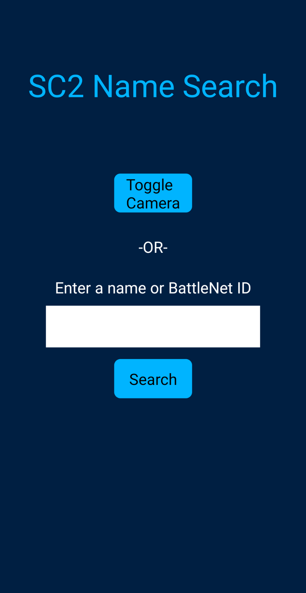
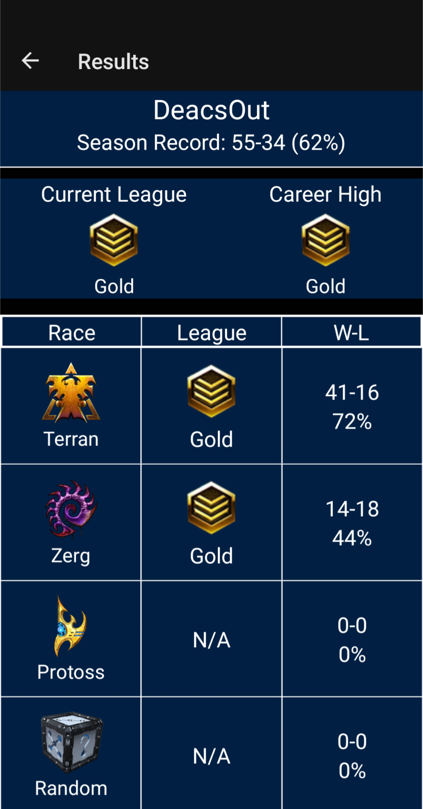

# SC2 Name Search

A react native app to search for starcraft2 users and display information about their account. 

---

### How To Use
  * Enter the SC2 username or BattleNet ID into the search bar to search for a player
  * or use your phones camera to take a picture of the name you wish to search
  * Beacuse of the way SC2 usernames work, searching for a specific name will only work if:
    * The user has an SC2ReplayStats account to connect their username to a BattleNet ID
    * The name is unique such that there is only 1 SC2ReplatStats account listed in the America server using that name
  * If either of those 2 criteria are not met, you must use the BattleNet ID to get the player's information
### Results
  The App will give the following results:
  * Name
  * Overall Win-Loss Ratio
  * Current League
  * Career High League
  * Race by Race League and Win-Loss Ratio
  

  ### Author
  Adam Bridgers